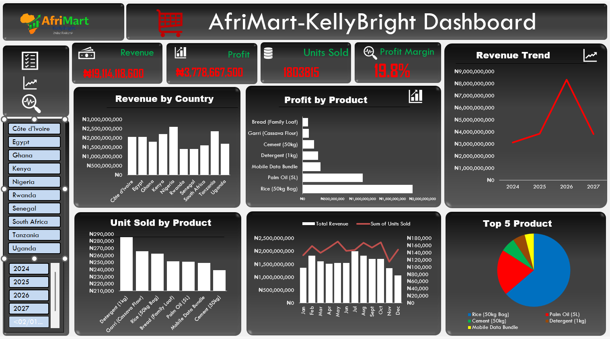

# 🛒 AfriMart-KollyBright Sales Dashboard

---

## 🔎 Quick Navigation

[📌 Overview](#-project-overview) •
[🎯 Business Questions](#-business-questions-answered) •
[📊 KPIs](#-key-kpis) •
[🛠️ Tools](#️-tools-used) •
[📈 Dashboard](#-dashboard-preview) •
[💡 Insights](#-key-insights) •
[📁 Files](#-files-in-repository) •
[🔄 Data Update](#-data-update) •
[✅ Conclusion](#-conclusion)

---

## 📊 Project Overview

The **AfriMart-KollyBright Sales Dashboard** is an interactive sales analysis and business 
intelligence dashboard developed in **Microsoft Excel**.

The dashboard provides a consolidated view of sales performance across multiple countries and
products, allowing users to analyze **revenue, profit, units sold, profit margin, product 
performance, geographical performance, and sales trends**.

The project initially started with **700 sales transactions**. An additional **525 transactions** 
were subsequently appended, bringing the final dataset to **1,225 transactions**.

The dashboard was refreshed using the complete dataset to provide an updated view of overall 
sales performance.

### 🌍 Dataset Coverage

- 1,225 final transactions
- 10 countries
- 7 products
- 700 initial transactions
- 525 additional transactions

---

## 🎯 Business Questions Answered

The dashboard was designed to answer key business questions, including:

- 💰 What is the total revenue generated?
- 💵 What is the total profit?
- 📈 What is the overall profit margin?
- 🌍 Which countries generate the highest revenue?
- 🏆 Which products contribute the most profit?
- 📦 Which products have the highest unit sales?
- 📅 How does revenue change over time?
- 🥇 Which products perform best in different regions?
- 📊 How do monthly revenue and units sold compare?

---

## 📊 Key KPIs

- 💰 Revenue
- 💵 Profit 
- 📦 Units Sold
- 📈 Profit Margin

---

## 🛠️ Tools Used

### 📗 Microsoft Excel

Excel was used for:

- Data preparation
- Data analysis
- Pivot Tables
- Pivot Charts
- Dashboard Development 
- Interactive filtering (Slicers)
- Data visualization
  
### 📊 PowerPoint

- PowerPoint was used to design the Dashboard layout

---

## 📈 Dashboard Preview



### Dashboard Components

The dashboard provides an interactive view of:

- 💵 Profit
- 📦 Units Sold
- 📈 Profit Margin
- 🌍 Revenue by Country
- 🏆 Profit by Product
- 📦 Units Sold by Product
- 📅 Revenue Trend
- 📊 Monthly Revenue & Units Sold
- 🥇 Top 5 Products

### Interactive Filters

Users can filter the dashboard by:

- 🌍 Country
- 📅 Year

---

## 💡 Key Insights

- 🇳🇬 Nigeria generated the highest revenue among the 10 countries.
- 🌾 Rice (50kg Bag) was the top revenue-generating product, contributing about 62% of total revenue.
- 🛢️ Palm Oil (5L) was the second-largest revenue contributor, generating about 20% of total revenue.
- 📈 Revenue more than doubled from 2024 to 2026, rising from ₦3.13B to ₦8.32B.
- 🏆 Rwanda recorded the highest profit margin, at approximately 21.4%.
- 🧾 Detergent had the highest transaction count, despite contributing a relatively small share of total revenue.
- 📉 Revenue declined in 2027 compared with 2026, falling from ₦8.32B to ₦3.81B.

---

## Files in Repository

[Raw Sales Dataset](AfriMart_Sales_Dataset.xlsx)
[Dashboard and Analysis](AfriMart_Dashboard_AmahaGenesis.xlsx)
[Dashboard Screenshot](dashboard_screenshot.png)
[AfriMart-KollyBright logo](012_AfriMart_KollyBright_logo.png)
README.md

---

## Conclusion

The dashboard provides an interactive view of sales performance across
countries and products, enabling users to examine revenue, profitability,
units sold, and sales trends from the complete dataset.

---

## 🔄 Data Update

The project was completed in two data stages:

```text
Initial Dataset
      ↓
700 Transactions
      ↓
Analysis & Dashboard Development
      ↓
Additional Dataset
      ↓
525 New Transactions
      ↓
Data Appended
      ↓
1,225 Final Transactions
      ↓
Dashboard Refreshed
